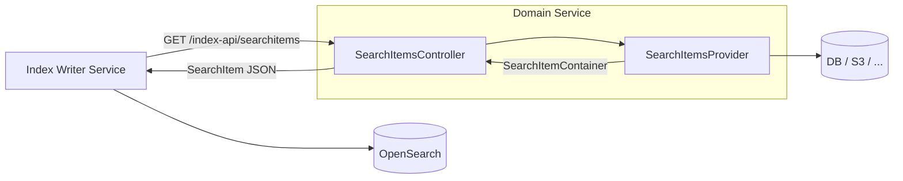

# Getting started

This page shows how to expose a SearchItem Provider endpoint from a domain service so that the
jEAP OpenSearch Index Writer can fetch search items for indexing. For the endpoint details see
[SearchItem endpoint](endpoint.md).

## Overview

The jEAP OpenSearch Index Writer fetches the search representation of a business object from the
owning domain service via HTTP before writing it to OpenSearch. This library provides the REST
controller and the `SearchItemsProvider` interface that the domain service implements.



## 1. Add the dependency

```xml
<dependency>
    <groupId>ch.admin.bit.jeap</groupId>
    <artifactId>jeap-opensearch-searchitem-api</artifactId>
</dependency>
```

The version is managed by the jEAP Spring Boot parent. This dependency auto-configures the
`SearchItemsController` REST endpoint.

## 2. Implement SearchItemsProvider

Implement `SearchItemsProvider` and register it as a Spring bean. The controller delegates all
lookups to this interface:

```java
@Component
@RequiredArgsConstructor
class DecreeDocumentSearchItemsProvider implements SearchItemsProvider {

    private final DecreeDocumentRepository repository;

    @Override
    public Optional<SearchItemContainer> findSearchItem(
            String indexType, String originId, String originVersion)
            throws SearchItemsBadInputException {

        if (!indexType.equals("JmeDecreeDocument")) {
            throw new SearchItemsBadInputException("Unknown index type: " + indexType);
        }

        return repository.findById(originId)
            .map(doc -> {
                SearchItem<DecreeDocumentData> item = SearchItem.of(
                    Origin.builder()
                        .id(doc.getId())
                        .version(doc.getVersion())
                        .bpId(doc.getBpId())
                        .created(doc.getCreatedAt())
                        .modified(doc.getModifiedAt())
                        .build(),
                    new DecreeDocumentData(doc.getTitle(), doc.getContent())
                );
                return new SearchItemContainer(1, 0, item);
            });
    }
}
```

## 3. Configure security

The endpoint `GET /index-api/searchitems` requires the caller to hold the role `searchitem:read`.
Register the index writer service's OAuth2 client with this role in your authorization
configuration.

## 4. Configure in the Index Writer

Point the operation's `uri` in `messages.json` at the domain service base URI:

```json
{
  "operations": [
    {
      "indexType": "JmeDecreeDocument",
      "indexOperation": "UPSERT",
      "uri": "${jme.resource.base-uri}",
      "oauthClientId": "jme-client-id",
      "referenceProvider": "ch.admin.bit.jme.indexwriter.DecreeDocumentReferenceProvider"
    }
  ]
}
```

The index writer appends `/index-api/searchitems?index_type=…&origin_id=…` to the configured URI.

## Related

- [SearchItem endpoint](endpoint.md)
- [jeap-opensearch-searchitem-api](../README.md)
